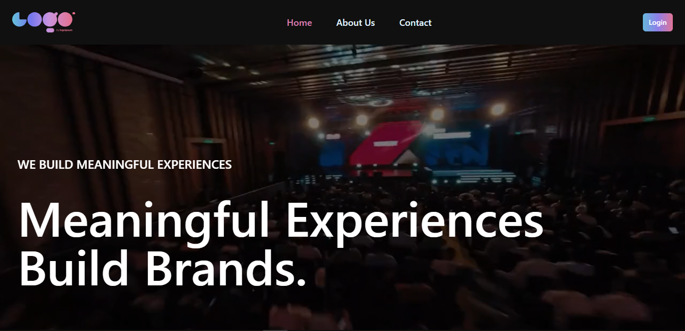

<h1 align="center">
Event Management with React, React-Router-Dom, Firebase</h1>

This is a repository for a Event Management Platform with  React, React Router Dom, Tailwind, Firebase.

## 📝 Features

- Different types of events services
- Responsive mobile navbar
- Beautiful animations effect using AOS
- Authentication with Firebase
- Full responsivity and mobile UI

## 🚀 Live Link

[https://event-management-d3d55.web.app/](https://event-management-d3d55.web.app/)

## 🎮 Demo Account

You can access using the following demo account:

- **Email**: tuser4818@gmail.com
- **Password**: #temp1234

## 💻 Technology Used

The event management website is built using the following technologies and libraries:

Dependencies:

- "aos": "^2.3.4"
- "firebase": "^10.4.0"
- "localforage": "^1.10.0"
- "match-sorter": "^6.3.1"
- "prop-types": "^15.8.1"
- "react": "^18.2.0"
- "react-dom": "^18.2.0"
- "react-hot-toast": "^2.4.1"
- "react-icons": "^4.11.0"
- "react-router-dom": "^6.16.0"
- "react-spinners": "^0.13.8"
- "sort-by": "^1.2.0"

Dev Dependencies:

- "@types/react": "^18.2.15"
- "@types/react-dom": "^18.2.7"
- "@vitejs/plugin-react": "^4.0.3"
- "autoprefixer": "^10.4.16"
- "eslint": "^8.45.0"
- "eslint-plugin-react": "^7.32.2"
- "eslint-plugin-react-hooks": "^4.6.0"
- "eslint-plugin-react-refresh": "^0.4.3"
- "postcss": "^8.4.31"
- "tailwindcss": "^3.3.3"
- "vite": "^4.4.5"

<h3>💖Like my work?</h3>

This project needs a ⭐️ from you. Don't forget to leave a star ⭐️.
